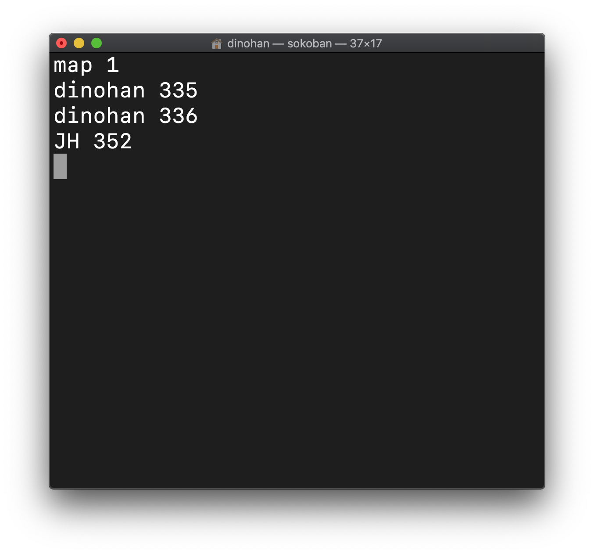

# 소코반 프로젝트

## 0. 조원 및 각 역할

이강준

이재호

정준서

한도협

## 1. 개요

## 2. 소스코드

```c
#include <stdio.h>
#include <stdlib.h>
#include <string.h>
#include <termios.h>
#include <unistd.h>

#define LEFT 104
#define UP 107
#define RIGHT 108
#define DOWN 106
#define UNDO 117
#define NEW  110
#define REPLAY 114
#define EXIT 101
#define SAVE 115
#define FILE_LOAD 102
#define DISPLAY_HELP 100
#define TOP 116
#define LF 10
#define CR 13

#define WALL 35
#define EMPTY 46
#define GOLD 36
#define PLAYER 64
#define STORAGE 79

#define NUMBER_OF_MAPS 5

#define MAPSIZE 31

int getch();								// 화면에 문자를 출력하지 않고 입력을 받는 함수
void gotoxy(int x, int y);	// 화면의 커서를 움직이는 함수
int Len(char *s);						// 문자열의 길이를 출력하는 함수
int MapLoading();						// map파일로부터 맵을 로딩하는 함수
int SetMap(int level);			// 현재 플레이할 맵을 레벨이 level인 맵으로 변경
int IsInMap(int, int);			// _pos가 맵 안에 있는 위치인지
void Input();								// 입력을 담당하는 함수
void Render();							// 화면 출력을 담당하는 함수
void Move(int delX, int delY, int undoMoving); // x축으로 delX만큼, y로 delY 만큼
void Undo();								// Undo 기능
void New();									// 새로시작
void DisplayHelp();					// 명령어를 출력하는 함수
int Save();									// 현재 맵 상태를 저장하는 함수
int FileLoad();							// sokoban파일로부터 저장된 내용을 불러와 적용시키는 함수
int RankingSave();					// 랭킹을 저장하는 함수
int RankingLoad();					// top파일로부터 랭킹 정보를 가져오는 함수 
void RankingDisplay();			// 랭킹을 출력하는 함수
int Clear();								// 게임을 클리어 했는지 확인하는 함수

// 저장되어야할 정보--------------------------------------------------------
char		name[10];						// 이름
int			movingCount;				// 움직인 개수
int			undoCount = 5;			// undo할 수 있는 횟수
int			currentLevel = 0;		// 현재 맵의 레벨 0 ~ 4
int			cMapData[MAPSIZE][MAPSIZE];	// 여기의 map 변수에는 금의 위치만 표시
int			cPos_x, cPos_y;			// 캐릭터의 현재 위치
// 최근 5회 움직인 정보
int			moveInfo_delta_x[5];
int			moveInfo_delta_y[5];
int			moveInfo_goldPos_x[5];
int			moveInfo_goldPos_y[5];

// 저장되지 않아도 되는 정보------------------------------------------------
// MAPDATA
int 		mapData[NUMBER_OF_MAPS][MAPSIZE][MAPSIZE];		// File로 부터 받아온 맵 정보
int			mapData_width[NUMBER_OF_MAPS];					// 맵의 길이
int			mapData_height[NUMBER_OF_MAPS];					// 맵의 높이
int			playerInitPos_x[NUMBER_OF_MAPS];				// 플레이어의 시작점
int			playerInitPos_y[NUMBER_OF_MAPS];				// 플레이어의 시작점

int			maxMapLevel = -1;

int			topPressedBeforeFrame;	// 이전 프레임에서 TOP키가 눌렸는지
int			showTopLevel = 0;				// 랭킹을 볼 맵의 레벨, 0 = 전체, 1 ~ 5 = 레벨
int			isPlay = 1;							// 현재 게임이 실행중인지.
// 랭킹 정보
char		rankingList_name[NUMBER_OF_MAPS][5][11];	// 이름
int			rankingList_moveCount[NUMBER_OF_MAPS][5];	// 이동 수


/*
- h(왼쪽), j(아래), k(위), l(오른쪽) : 왼쪽 아래 위 오른쪽 창고지기 조정
- u(undo) : 5 최대 번 할 수 있음
- r(replay) : ( ) 현재 맵을 처음부터 다시 시작 움직임 횟수는 계속 유지
- n(new) : ( ) 첫 번째 맵부터 다시 시작 움직임 횟수 기록 삭제
- e(exit) : . 게임 종료 종료하기 전 필요한 정보 저장해야 함
- s(save) : . sokoban 현재 상태 파일에 저장 파일 이름은 으로 하고 다음에 다시 게임을 연속해서 할
수 있도록 모든 상태 저장해야 함
- f(file load) : sokoban save 파일에서 저장된 내용을 읽어 시점에서부터 이어서 게임하게 함
- d(display help) : 명령 내용 보여줌
- t(top) : . t . t 게임 순위 보여줌 만 입력하면 전체 순위 다음 숫자가 오면 해당 맵W의 순위
*/

int main() {

	if (!MapLoading()) {
		fprintf(stderr, "MapLoading() Error\n");
		return 0;
	}

	printf("이름을 입력하십시오: ");
	scanf("%s", name);

	if (!SetMap(0)) {
		fprintf(stderr, "Init SetMap() Error\n");
		return 0;
	}
	RankingLoad();

	while (isPlay) {
		Input();
		Render();

		if (Clear()) {

			system("clear");
			RankingSave();
			printf("#####################################\n");
			printf("#                                   #\n");
			printf("#                                   #\n");
			printf("#                                   #\n");
			printf("#              %02d Clear             #\n", currentLevel + 1);
			printf("#                                   #\n");
			printf("#                                   #\n");
			printf("#                                   #\n");
			printf("#####################################\n");

			getch();
			if (currentLevel >= maxMapLevel - 1) {
				isPlay = 0;
			}


			currentLevel++;
			New();
		}
	}

}

void Input() {

	int topPressed = 0;
	char c = getch();
	switch (c) {
	case LEFT:
		Move(-1, 0, 0);
		break;
	case UP:
		Move(0, -1, 0);
		break;
	case RIGHT:
		Move(1, 0, 0);
		break;
	case DOWN:
		Move(0, 1, 0);
		break;
	case UNDO:
		Undo();
		break;
	case NEW:
		New();
		break;
	case REPLAY:
		SetMap(currentLevel);
		break;
	case SAVE:
		Save();
		break;
	case FILE_LOAD:
		FileLoad();
		break;
	case DISPLAY_HELP:
		DisplayHelp();
		break;
	case TOP:
		topPressed = 1;
		break;
	case EXIT:
		Save();
		isPlay = 0;
		break;
	case LF:
	case CR:
		if (topPressedBeforeFrame)
		{
			RankingDisplay();
			showTopLevel = 0;
		}
	default:
		if (topPressedBeforeFrame) {
			if (c - '0' >= 1 && c - '0' <= NUMBER_OF_MAPS) {
				topPressed = 1;
				showTopLevel = c - '0';
			}
		}
		else showTopLevel = 0;

	}

	topPressedBeforeFrame = topPressed;
}

void Render() {
	gotoxy(0, 0);
	printf("\tHello %s\n\n", name);
	for (int y = 0; y < mapData_height[currentLevel]; y++, printf("\n")) {
		for (int x = 0; x < mapData_width[currentLevel]; x++) {
			if (cPos_x == x && cPos_y == y)
				printf("%c", PLAYER);
			else if (cMapData[y][x] != EMPTY)
				printf("%c", GOLD);
			else if (mapData[currentLevel][y][x] == WALL || mapData[currentLevel][y][x] == STORAGE)
				printf("%c", mapData[currentLevel][y][x]);
			else
				printf(" ");
		}
	}

	printf("\n");
	printf("MovingCount: %5d\n", movingCount);
	printf("undoCount  : %5d\n", undoCount);
}

void Move(int delX, int delY, int undoMoving) {
	int goldPos_x = -1;
	int goldPos_y = -1;
	int _pos_x = cPos_x + delX;
	int _pos_y = cPos_y + delY;
	if (!IsInMap(_pos_x, _pos_y))
		return;

	if (mapData[currentLevel][_pos_y][_pos_x] == WALL)
		return;

	if (cMapData[_pos_y][_pos_x] == GOLD)
	{
		goldPos_x = _pos_x + delX;
		goldPos_y = _pos_y + delY;
		if (!IsInMap(goldPos_x, goldPos_y))
			return;
		if (mapData[currentLevel][goldPos_y][goldPos_x] == WALL)
			return;
		if (cMapData[goldPos_y][goldPos_x] != EMPTY)
			return;

		cMapData[goldPos_y][goldPos_x] = GOLD;
		cMapData[_pos_y][_pos_x] = EMPTY;

	}
	cPos_x = _pos_x;
	cPos_y = _pos_y;
	movingCount++;

	if (!undoMoving) {
		int pInfo_delta_x = delX * -1;
		int pInfo_delta_y = delY * -1;
		int pInfo_goldPos_x = goldPos_x;
		int pInfo_goldPos_y = goldPos_y;

		for (int i = 4; i > 0; i--) {
			moveInfo_delta_x[i] = moveInfo_delta_x[i - 1];
			moveInfo_delta_y[i] = moveInfo_delta_y[i - 1];
			moveInfo_goldPos_x[i] = moveInfo_goldPos_x[i - 1];
			moveInfo_goldPos_y[i] = moveInfo_goldPos_y[i - 1];
		}
		moveInfo_delta_x[0] = pInfo_delta_x;
		moveInfo_delta_y[0] = pInfo_delta_y;
		moveInfo_goldPos_x[0] = pInfo_goldPos_x;
		moveInfo_goldPos_y[0] = pInfo_goldPos_y;
	}
}

void Undo() {
	if (undoCount <= 0)
		return;
	if (moveInfo_delta_x[0] == 0 && moveInfo_delta_y[0] == 0)
		return;


	Move(moveInfo_delta_x[0], moveInfo_delta_y[0], 1);
	if (moveInfo_goldPos_x[0] != -1 && moveInfo_goldPos_y[0] != -1) {
		int goldPos_x = moveInfo_goldPos_x[0] + moveInfo_delta_x[0];
		int goldPos_y = moveInfo_goldPos_y[0] + moveInfo_delta_y[0];

		cMapData[moveInfo_goldPos_y[0]][moveInfo_goldPos_x[0]] = EMPTY;
		cMapData[goldPos_y][goldPos_x] = GOLD;

	}
	undoCount--;
	movingCount++;

	for (int i = 0; i < 4; i++) {
		moveInfo_delta_x[i] = moveInfo_delta_x[i + 1];
		moveInfo_delta_y[i] = moveInfo_delta_y[i + 1];
		moveInfo_goldPos_x[i] = moveInfo_goldPos_x[i + 1];
		moveInfo_goldPos_y[i] = moveInfo_goldPos_y[i + 1];
	}
}

void New() {
	movingCount = 0;
	undoCount = 5;
	SetMap(currentLevel);
}

void DisplayHelp() {
	system("clear");
	printf("h(왼쪽), j(아래), k(위), l(오른쪽)\n");
	printf("u(undo)\n");
	printf("r(replay)\n");
	printf("n(new)\n");
	printf("e(exit)\n");
	printf("s(save)\n");
	printf("f(file load)\n");
	printf("d(display help)\n");
	printf("t(top)\n");

	char c;
	do {
		c = getch();
	} while (!(c == LF || c == CR));

	system("clear");
}

int Save() {
	FILE *sokoban;

	if ((sokoban = fopen("sokoban.txt", "w")) == NULL) {
		fprintf(stderr, "sokoban.txt 파일을 불러오지 못 했습니다.\n");
		return 0;
	}

	fprintf(sokoban, "%s\n", name);
	fprintf(sokoban, "%d\n", movingCount);
	fprintf(sokoban, "%d\n", undoCount);
	fprintf(sokoban, "%d\n", currentLevel);
	// 맵 정보 저장
	for (int y = 0; y < mapData_height[currentLevel]; y++)
		for (int x = 0; x < mapData_width[currentLevel]; x++)
			fprintf(sokoban, "%d ", cMapData[y][x]);

	fprintf(sokoban, "%d %d\n", cPos_x, cPos_y);

	fclose(sokoban);
	return 1;
}

int FileLoad() {
	FILE *sokoban;

	if (access("sokoban.txt", 0) == -1) {
		fprintf(stderr, "sokoban.txt 파일이 존재하지 않습니다.\n");
		return 0;
	}

	if ((sokoban = fopen("sokoban.txt", "r")) == NULL) {
		fprintf(stderr, "sokoban.txt 파일을 불러오지 못 했습니다.\n");
		return 0;
	}
	int level;

	fscanf(sokoban, "%s", &name);
	fscanf(sokoban, "%d", &movingCount);
	fscanf(sokoban, "%d", &undoCount);
	fscanf(sokoban, "%d", &currentLevel);

	for (int y = 0; y < mapData_height[currentLevel]; y++)
		for (int x = 0; x < mapData_width[currentLevel]; x++)
			fscanf(sokoban, "%d", &cMapData[y][x]);
	fscanf(sokoban, "%d %d", &cPos_x, &cPos_y);

	fclose(sokoban);

	system("clear");
	Render();
	return 1;
}

int RankingSave() {
	FILE *ranking;


	for (int i = 0; i < NUMBER_OF_MAPS; i++)
	{
		if (rankingList_moveCount[currentLevel][i] == 0)
		{
			strcpy(rankingList_name[currentLevel][i], name);
			rankingList_moveCount[currentLevel][i] = movingCount;
			break;
		}

		if (rankingList_moveCount[currentLevel][i] > movingCount)
		{
			for (int j = i; j < NUMBER_OF_MAPS - 1; j++)
			{
				strcpy(rankingList_name[currentLevel][i + 1], rankingList_name[currentLevel][i]);
				rankingList_moveCount[currentLevel][i + 1] = rankingList_moveCount[currentLevel][i];
			}
			strcpy(rankingList_name[currentLevel][i], name);
			rankingList_moveCount[currentLevel][i] = movingCount;
			break;
		}
	}

	if ((ranking = fopen("ranking.txt", "w")) == NULL)
	{
		fprintf(stderr, "ranking.txt 파일을 불러오지 못 했습니다.\n");
		return 0;
	}

	for (int i = 0; i < NUMBER_OF_MAPS; i++) {
		fprintf(ranking, "RankingLevel%d\n", i);
		for (int j = 0; j < 5; j++) {
			if (rankingList_moveCount[i][j] > 0) {
				fprintf(ranking, "%s %d\n", rankingList_name[i][j], rankingList_moveCount[i][j]);
			}
			else break;
		}
	}
	fclose(ranking);


	return 1;
}

int RankingLoad() {
	FILE *ranking;

	int level = 0;

	if (access("ranking.txt", 0) == -1)
	{
		return 0;
	}

	if ((ranking = fopen("ranking.txt", "r")) == NULL)
	{
		fprintf(stderr, "ranking.txt 파일을 불러오지 못 했습니다.\n");
		return 0;
	}

	char s[10000];
	int rankingNum = 0;
	int strlen = 0;

	while ((fscanf(ranking, "%s", s)) != EOF)
	{
		strlen = Len(s);

		if (strlen == (Len("RankingLevel") + 1) && strncmp("RankingLevel", s, strlen - 1) == 0) {
			level = s[strlen - 1] - '0';
			rankingNum = 0;
		}
		else {
			strncpy(rankingList_name[level][rankingNum], s, strlen);
			fscanf(ranking, "%d", &rankingList_moveCount[level][rankingNum]);
			rankingNum++;
		}
	}
	fclose(ranking);
	return 1;
}

void RankingDisplay() {

	system("clear");

	if (showTopLevel == 0) {
		for (int i = 0; i < NUMBER_OF_MAPS; i++) {
			printf("map %d\n", i + 1);
			for (int j = 0; j < 5; j++) {
				if (rankingList_moveCount[i][j] > 0) {
					printf("%s %d\n", rankingList_name[i][j], rankingList_moveCount[i][j]);
				}
				else {
				    if (j == 0) {
					    printf("-\n");
					    break;
					}
				}
			}
		}
	}
	else {
		printf("map %d\n", showTopLevel);
		for (int i = 0; i < 5; i++) {
			if (rankingList_moveCount[showTopLevel - 1][i] > 0) {
				printf("%s %d\n", rankingList_name[showTopLevel - 1][i], rankingList_moveCount[showTopLevel - 1][i]);
			}
			else {
			    if (i ==0){
					printf("-\n");
					break;
			    }
			}
		}
	}

	char c;
	do {
		c = getch();
	} while ( !(c == LF || c == CR));
	system("clear");
}

int MapLoading() {
	FILE *mapFile;

	if (access("map.txt", 0) == -1) {
		fprintf(stderr, "map.txt 파일이 존재하지 않습니다.\n");
		return 0;
	}

	if ((mapFile = fopen("map.txt", "r")) == 0) {
		printf("map.txt 파일을 불러오지 못 했습니다.\n");
		return 0;
	}

	char s[MAPSIZE];	// 한 줄씩 받아오기 위한 변수
	int returnValue = 1;	// 리턴 값 1 == 정상작동, 0 == 비정상작동

	int strLength = 0;	// 현재 읽어드린 문자열의 길이 
	int currentY = 0;	// 현재 로드 중인 맵의 Y축 위치

	int goldCount = 0, storageCount = 0; // 금괴 개수와 저장소 개수가 맞는 확인하는 변수
	while (fscanf(mapFile, "%s", s) != EOF) { // 입력이 존재하면
		strLength = Len(s);
		if (strLength > 30) {
			printf("적합하지 않은 map파일입니다.\n");
			returnValue = 0;
			break;
		}

		if (strLength == 1) {
			if (s[0] == 'e')
				break;
			else if (s[0] - '0' > 0) {
				if (goldCount != storageCount) {
					printf("%d번 맵의 골드와 보관장소의 개수가 맞지 않습니다.\n", maxMapLevel);
					returnValue = 0;
				}
				goldCount = 0;
				storageCount = 0;

				maxMapLevel = s[0] - '0';
				currentY = 0;
			}
		}
		else {
			if (maxMapLevel - 1 >= 0) {
				if (currentY == 0)
					mapData_width[maxMapLevel - 1] = strLength;
				for (int i = 0; i < strLength; i++) {
					if (s[i] == GOLD)
						goldCount++;
					else if (s[i] == STORAGE)
						storageCount++;

					if (s[i] == PLAYER) {
						playerInitPos_x[maxMapLevel - 1] = i;
						playerInitPos_y[maxMapLevel - 1] = currentY;
						mapData[maxMapLevel - 1][currentY][i] = EMPTY;
					}
					else
						mapData[maxMapLevel - 1][currentY][i] = s[i];
				}
				mapData_height[maxMapLevel - 1] = ++currentY;
				if (currentY + 1 > 30) {
					printf("적합하지 않은 map파일입니다.\n");
					returnValue = 0;
					break;
				}
			}
		}
		//printf("%s\n", s);
	}

	fclose(mapFile);
	return returnValue;
}

int SetMap(int level) {

	currentLevel = level; // 현재 게임 레벨을 level로 설정
	if (!(mapData_width[currentLevel] > 0 && mapData_height[currentLevel] > 0))
    // level에 해당하는 맵이 존재하지 않으면 게임 종료
		return 0;

	for (int i = 0; i = 5; i++)
	{
		moveInfo_delta_x[i] = 0;
		moveInfo_delta_y[i] = 0;
		moveInfo_goldPos_x[i] = 0;
		moveInfo_goldPos_y[i] = 0;
	}

	// cMapData는 금괴의 정보를 담고 있는 배열로 
	// 원본 맵에서 금괴위치 말고는 EMPTY로 초기화
	for (int y = 0; y < mapData_height[currentLevel]; y++) {
		for (int x = 0; x < mapData_width[currentLevel]; x++) {
			if (mapData[currentLevel][y][x] == GOLD)
				cMapData[y][x] = mapData[currentLevel][y][x];
			else
				cMapData[y][x] = EMPTY;
		}
	}
	cPos_x = playerInitPos_x[currentLevel]; // 플레이어의 현재 위치를 초기 위치로 설정
	cPos_y = playerInitPos_y[currentLevel]; // 플레이어의 현재 위치를 초기 위치로 설정

	system("clear");	// 화면 비우기
	Render(); 				// 맵 출력
	return 1;
}

int Clear() {
	// 게임 클리어 조건 확인 함수
	for (int y = 0; y < mapData_height[currentLevel]; y++) {
		for (int x = 0; x < mapData_width[currentLevel]; x++) {
			// 금괴 중 1개라도 저장소 위치에 있지 않다면 0 반환
			if (cMapData[y][x] == GOLD && mapData[currentLevel][y][x] != STORAGE)
				return 0;
		}
	}
	return 1;
}

int Len(char *s) {
	// 문자열의 길이를 구하는 함수
	// 문자열의 인덱스를 0부터 확인하면서 '\0'가 아닐 때까지 i를 1씩 더함
	int i = 0;
	while (s[i] != '\0') {
		i++;
	}
	return i;

}

int IsInMap(int _pos_x, int _pos_y) {
    // _pos의 x, y 좌표가 유요한 위치에 있지 않다면 0을 반환
	if (_pos_x < 0 || _pos_y < 0 || _pos_y >= mapData_height[currentLevel] || _pos_x >= mapData_width[currentLevel])
		return 0;
	return 1;
}

void gotoxy(int x, int y) {
	printf("\033[%d;%df", y, x);	// 터미널 상에서 x, y좌표로 커서를 이동
	fflush(stdout);								// 출력 버퍼를 비움
}

int getch(){
    int c;
    struct termios oldattr,newattr;

    tcgetattr(STDIN_FILENO,&oldattr);					// 현재 터미널 설정 읽음
    newattr = oldattr;
    newattr.c_lflag &= ~(ICANON | ECHO); 			// CANONICAL과 ECHO 끔
    newattr.c_cc[VMIN] = 1;										// 최소 입력 문자 수를 1로 설정
    newattr.c_cc[VTIME] = 0;									// 최소 읽기 대기 시간을 0으로 설정
    tcsetattr(STDIN_FILENO,TCSANOW,&newattr);	// 터미널에 설정 입력
    c = getchar();														// 키보드 입력 읽음
    tcsetattr(STDIN_FILENO,TCSANOW,&oldattr);	// 원래의 설정으로 복구
    return c;
}
```


## 3. 실행 화면

### Input name


### Game Play


### Level Clear


### Top


### Top 1



### Display Help

